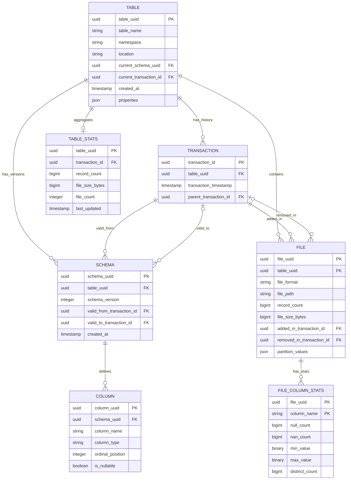

# Planar

An open table format with a database-backed catalog architecture. Designed for streaming and CDC workloads with efficient incremental updates.

## Design Principles

- **DB-backed control plane, file-native data plane**: Metadata lives in a transactional database for strong consistency and simple coordination. Data lives in immutable files in object storage for scale and cost efficiency.
- **Streaming as a first-class citizen**: Optional in-memory buffering prevents the small file problem for high-frequency writes.
- **Format-flexible**: Support for Parquet, Lance, Vortex, and other columnar formats.

## Architecture

Planar splits into two planes:

- **Control Plane**: A relational database (SQLite, PostgreSQL, MySQL) stores catalog metadata, transactions, schemas, and file references.
- **Data Plane**: Immutable data files in object storage or local filesystem.

```
┌─────────────────────────────────────────────────────────────────────────────┐
│                              Control Plane (DB)                             │
│  tables │ transactions │ schemas │ columns │ files │ stats                  │
└─────────────────────────────────────────────────────────────────────────────┘
                                      │
                                      ▼
┌─────────────────────────────────────────────────────────────────────────────┐
│                           Data Plane (Object Storage)                       │
│   s3://bucket/tables/{uuid}/data/*.parquet                                  │
└─────────────────────────────────────────────────────────────────────────────┘
```

See [docs/architecture/db_control_plane.md](docs/architecture/db_control_plane.md) for the full control plane design.

## Data Model

- **Table**: Root entity with pointers to current schema and transaction.
- **Transaction**: Immutable version chain. Each commit creates a new transaction.
- **Schema**: Column definitions with transaction-bounded validity ranges.
- **File**: Physical data files with lifecycle tracking (`added_in`/`removed_in` transaction).

Point-in-time views are computed on-demand by filtering files and schemas by transaction ID. There are no explicit snapshot objects.



## Roadmap

Features are listed in priority order. Each item links to detailed architecture documentation.

### Tier 1: Foundation
- **Data types**: Canonical type system with Arrow-based types, format conversions, and schema evolution rules. See [data_types.md](docs/architecture/data_types.md)
- **File formats**: Complete Parquet, Lance, and Vortex implementations with statistics extraction and predicate pushdown. See [file_formats.md](docs/architecture/file_formats.md)

### Tier 2: Core Storage
- **Deletion vectors**: Row-level deletes using Roaring bitmaps to avoid rewriting entire files. See [deletion_vectors.md](docs/architecture/deletion_vectors.md)
- **Partitioning**: Metadata-driven partition pruning with hidden partitioning transforms (year, month, bucket). See [partitioning.md](docs/architecture/partitioning.md)
- **Compaction**: Background file rewriting to merge small files, materialize deletions, and optimize layouts. See [compaction.md](docs/architecture/compaction.md)

### Tier 3: Query & Integration
- **Query planning**: Statistics-driven optimization with file pruning, column projection, and format-aware pushdown. See [query_planning.md](docs/architecture/query_planning.md)
- **External access**: Direct database access or REST API for Spark, Trino, DuckDB, and other engines. See [external_access.md](docs/architecture/external_access.md)

### Tier 4: Streaming & Real-time
- **CDC**: Change data capture APIs for incremental processing and data replication. See [cdc.md](docs/architecture/cdc.md)
- **Streaming buffer**: Optional in-memory write buffer to prevent small file problem (requires additional infrastructure). See [streaming_buffer.md](docs/architecture/streaming_buffer.md)

### Tier 5: Advanced Features
- **Multi-table transactions**: Atomic commits across multiple tables using two-phase commit (opt-in complexity). See [multi_table_txn.md](docs/architecture/multi_table_txn.md)
- **Security**: Authentication, authorization, encryption, and audit logging for production deployments. See [security.md](docs/architecture/security.md)


## Open Questions
- Is the DataType <> Arrow IPC design optimal?
- Our catalog `Column` type diverges from Arrow `Field`. Should we better align these?

## License

[TBD]
