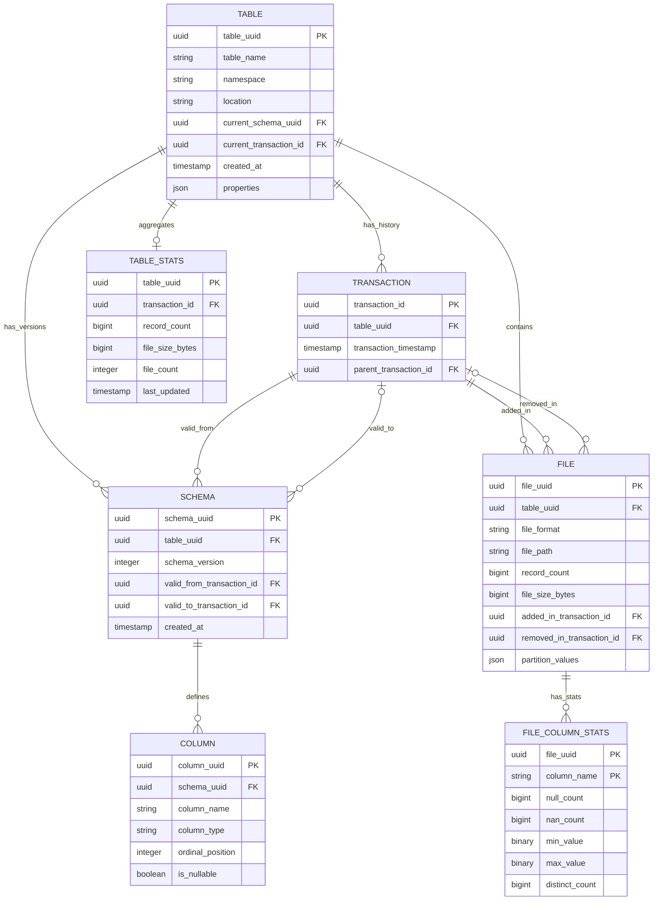

# Planar

An open table format with a database-backed catalog architecture. Designed for streaming and CDC workloads with efficient incremental updates.

## Design Principles

- **DB-backed control plane, file-native data plane**: Metadata lives in a transactional database for strong consistency and simple coordination. Data lives in immutable files in object storage for scale and cost efficiency.
- **Streaming as a first-class citizen**: Optional in-memory buffering prevents the small file problem for high-frequency writes.
- **Engine-agnostic**: Any reader or writer that can query the metadata database and read files can participate.
- **Format-flexible**: Support for Parquet, Lance, Vortex, and other columnar formats.

## Quick Start

Run the table lifecycle example:

```bash
cargo run --example table_lifecycle
```

This demonstrates creating tables, adding files, time travel queries, and transaction deltas. See `examples/table_lifecycle.rs` for the full code.

## Architecture

Planar splits into two planes:

- **Control Plane**: A relational database (SQLite or PostgreSQL) stores catalog metadata, transactions, schemas, and file references.
- **Data Plane**: Immutable data files in object storage or local filesystem.

```
┌─────────────────────────────────────────────────────────────────────────────┐
│                              Control Plane (DB)                             │
│  tables │ transactions │ schemas │ columns │ files │ stats                  │
└─────────────────────────────────────────────────────────────────────────────┘
                                      │
                                      ▼
┌─────────────────────────────────────────────────────────────────────────────┐
│                           Data Plane (Object Storage)                       │
│   s3://bucket/tables/{uuid}/data/*.parquet                                  │
└─────────────────────────────────────────────────────────────────────────────┘
```

See [docs/architecture/db_control_plane.md](docs/architecture/db_control_plane.md) for the full control plane design.

## Data Model

- **Table**: Root entity with pointers to current schema and transaction.
- **Transaction**: Immutable version chain. Each commit creates a new transaction.
- **Schema**: Column definitions with transaction-bounded validity ranges.
- **File**: Physical data files with lifecycle tracking (`added_in`/`removed_in` transaction).

Point-in-time views are computed on-demand by filtering files and schemas by transaction ID. There are no explicit snapshot objects.



## Roadmap

### Current Focus

**Core functionality**:
- Commit protocol with conflict detection
- Time travel queries
- Schema evolution
- File format support (Parquet, Lance, Vortex)

**In progress**:
- Row-level deletes (deletion vectors)
- Orphan file GC
- Transaction retention policies

### Near-Term

**Streaming support**: Optional buffer server for accumulating small writes before flushing to files. See [docs/architecture/streaming_buffer.md](docs/architecture/streaming_buffer.md).

**CDC support**: Change data capture APIs for incremental processing.

**External engine access**: Enable Spark, Trino, DuckDB, and other engines to read Planar tables. See [docs/architecture/external_access.md](docs/architecture/external_access.md).

**Table maintenance**: Unified maintenance daemon for GC, compaction, and statistics (similar to Postgres autovacuum).

### Future Considerations

These are problems worth solving eventually, but not currently planned:

**Manifest indirection**: For tables with millions of files, store file metadata in manifest files rather than directly in the database. Improves scalability but adds complexity.

**Multi-table transactions**: Atomic commits across multiple tables. Requires two-phase commit protocol.

**File-based transaction log**: Alternative to DB-backed catalog for cloud-native deployments where a database is undesirable.

## Design Documents

Detailed architecture documentation lives in `docs/architecture/`:

- [db_control_plane.md](docs/architecture/db_control_plane.md) - Core metadata architecture, commit protocol, conflict handling, maintenance
- [streaming_buffer.md](docs/architecture/streaming_buffer.md) - Optional write buffering for streaming workloads
- [external_access.md](docs/architecture/external_access.md) - API design for external engine integration

## License

[TBD]
